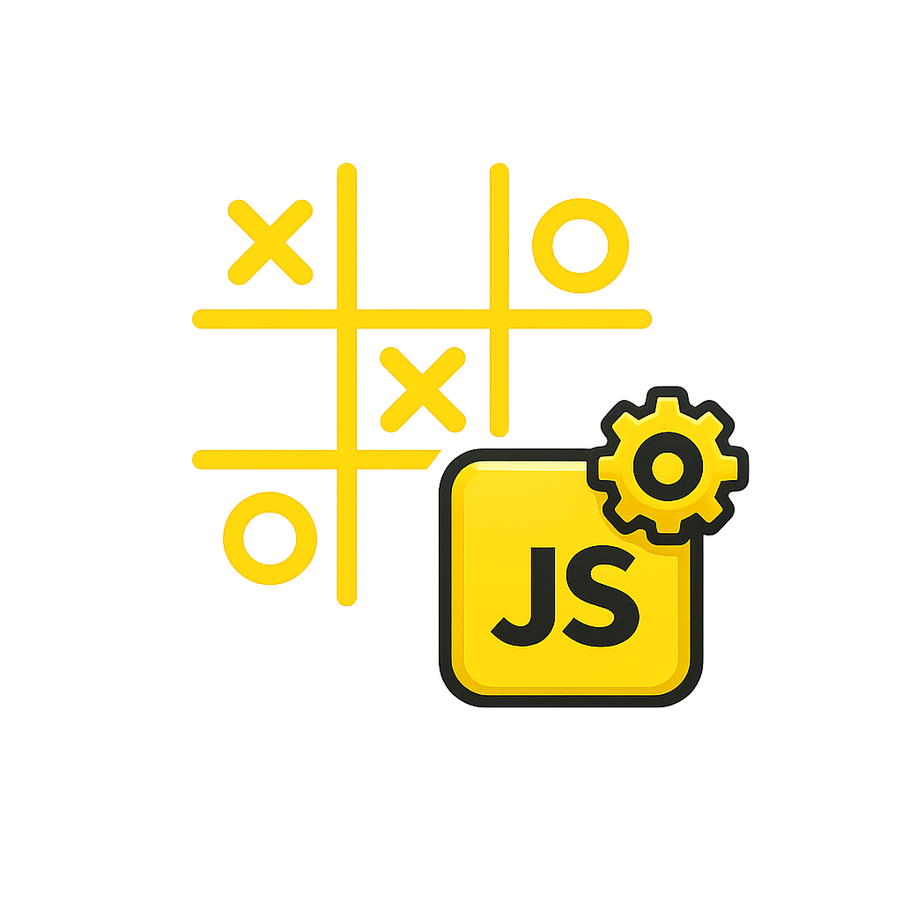

  

# ❌ Jogo da Velha / Tic-Tac-Toe

  
  
  
  
  
  
  
  
  

---

## 📄 Descrição / Description

| 🇧🇷 **PT-BR** | 🇺🇸 **EN** |
| --- | --- |
| Jogo da Velha completo utilizando apenas HTML, CSS e JavaScript. Inclui lógica de vitória, empate e alternância de turnos, funcionando diretamente no navegador sem qualquer dependência externa. | Fully functional Tic-Tac-Toe built with HTML, CSS and JavaScript. Implements win logic, draw detection and turn switching. Runs entirely in the browser with no external dependencies. |

---

## ✨ Funcionalidades / Features

| 🇧🇷 **Recursos (PT-BR)** | 🇺🇸 **Features (EN)** |
| --- | --- |
| • Grade 3×3 • Sistema de turno (X/O) • Verificação de vitória • Verificação de empate • Reinício rápido da partida • Zero dependências externas | • 3×3 grid • Turn-based system (X/O) • Win detection • Draw detection • Quick game reset • No external dependencies |

---

## ▶️ Como executar / How to run

| 🇧🇷 **PT-BR** | 🇺🇸 **EN** |
| --- | --- |
| • Abra o projeto no VS Code • Clique em `index.html` para abrir no navegador • Ou use a extensão Live Server | • Open the project in VS Code • Open `index.html` in your browser • Or use the Live Server extension |

---

## 🗂️ Estrutura / Structure

| 🇧🇷 **Estrutura (PT-BR)** | 🇺🇸 **Structure (EN)** |
| --- | --- |
| index.html script-v2.js styles.css icons/icon.png (ícone README) icons/favicon.png (ícone HTML) | index.html script-v2.js styles.css icons/icon.png (README icon) icons/favicon.png (HTML icon) |

---

## 🌐 Ícones HTML / HTML Icons

| 🇧🇷 **PT-BR** | 🇺🇸 **EN** |
| --- | --- |
| Adicione o `favicon.png` dentro da tag `<head>` em todas as páginas HTML. | Add `favicon.png` inside the `<head>` tag in all HTML pages. |

### Linha para inserir nos HTML:

    <link rel="icon" type="image/png" href="./icons/favicon.png">

---

## 📄 Licença / License

Este projeto está licenciado sob MIT License.  
This project is licensed under the MIT License.

---

## 👤 Autor | Author

Criado por João Albero · 2025  
Created by João Albero · 2025